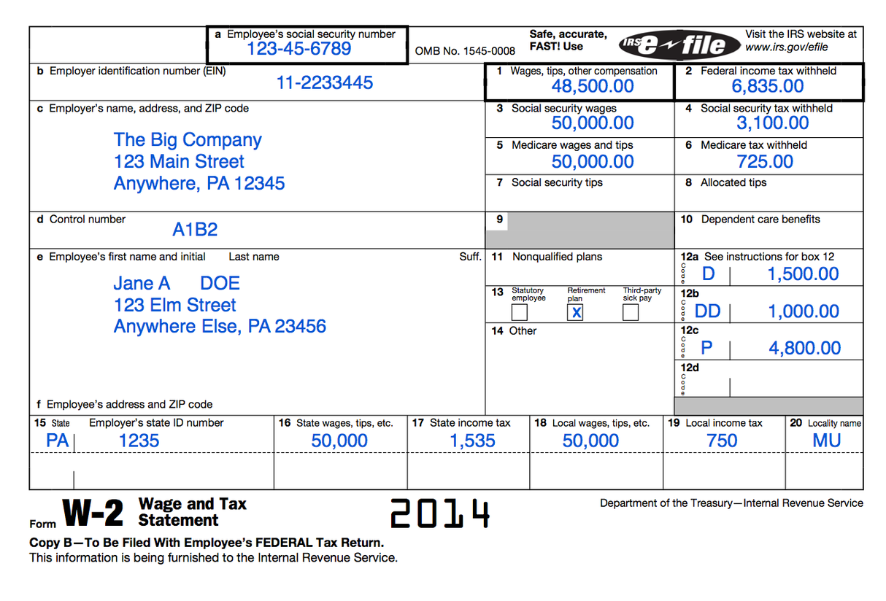

# Using Textract and Comprehend for Document Entity Extraction

### Document Entity Extraction involves extracting information from a document so that a user does not have to manually enter data for downstream processing. AWS offers 2 AI services for this workflow and this notebook tells you how to use these services and also looks at the cost involved. In this example we read Name and Address from a sample W2 which can be used for PII redaction in the downstream workflow.


```python
# Import the required libraries
import os
import boto3
import re
import json
import sagemaker
from sagemaker import get_execution_role
region = boto3.Session().region_name
role = get_execution_role()
bucket = sagemaker.Session().default_bucket()
```


```python
# Display the document to verify results of extraction
%matplotlib inline
import json
import io
import matplotlib.pyplot as plt
import matplotlib.patches as patches
from PIL import Image
import numpy as np
import matplotlib as mpl
from imageio import imread
import base64
dpi=72

# Download the image from S3 and hold it in memory
documentName="pii-detection-redaction/w2.png"
s3=boto3.resource('s3')
img_bucket = s3.Bucket(bucket)
img_object = img_bucket.Object(documentName)
xray = io.BytesIO()
img_object.download_fileobj(xray)
img = np.array(Image.open(xray), dtype=np.uint8)
print(img.shape)
# Set the image color map to grayscale, turn off axis grapiing, and display the image
height, width,channel = img.shape
# What size does the figure need to be in inches to fit the image?
figsize = width / float(dpi), height / float(dpi)
# Create a figure of the right size with one axes that takes up the full figure
fig = plt.figure(figsize=figsize)
ax = fig.add_axes([0, 0, 1, 1])
# Hide spines, ticks, etc.
ax.axis('off')
# Display the image.
ax.imshow(img, cmap='gray')
plt.show()
```

    (810, 1200, 3)





```python
# Extracting required entities using Textract
textract = boto3.client('textract')
from trp import Document

# Call Amazon Textract

response = textract.analyze_document(
    Document={
        'S3Object': {
            'Bucket': bucket,
            'Name': documentName
        }
    },
    FeatureTypes=[
        'FORMS'
    ]
)


doc = Document(response)

for page in doc.pages:
    # Print fields
    # print("Fields:")
    # for field in page.form.fields:
       # print("Key: {}, Value: {}".format(field.key, field.value))

    # Search fields by key
    print("\nSearch Fields:")
    key= "Name"
    fields = page.form.searchFieldsByKey(key)
    for field in fields:
        print("Key: {}, Value: {}".format(field.key, field.value))
    
    key= "Address"  
    fields = page.form.searchFieldsByKey(key)
    for field in fields:
        print("Key: {}, Value: {}".format(field.key, field.value))
```

    
    Search Fields:
    Key: 20 Locality name, Value: MU
    Key: c Employer's name, address, and ZIP code, Value: The Big Company 123 Main Street Anywhere, PA 12345
    Key: e Employee's first name and initial Last name, Value: Jane A DOE
    Key: c Employer's name, address, and ZIP code, Value: The Big Company 123 Main Street Anywhere, PA 12345
    Key: f Employee's address and ZIP code, Value: 123 Elm Street Anywhere Else, PA 23456


### As we can see with Textract we are able to search for keywords "Name" and "Address". Textract cost to analyze document with Forms is $0.05/page. However, in case we don't have theses keywords we will have to use NLP APIs from Comprehend. We use Comprehend Entity Recognition on Textract read text to identify name and address.


```python
# Extracting required entities using Textract & Comprehend

textract = boto3.client('textract')
comprehend = boto3.client('comprehend')


response = textract.analyze_document(
    Document={
        'S3Object': {
            'Bucket': bucket,
            'Name': documentName
        }
    },
    FeatureTypes=[
        'FORMS'
    ]
)

text = ""
for item in response["Blocks"]:
    if item["BlockType"] == "LINE":
       # print ('\033[94m' +  item["Text"] + '\033[0m')
        text = text + " " + item["Text"]

comprehend = boto3.client('comprehend')

entities =  comprehend.detect_entities(LanguageCode="en", Text=text)
print("\nEntities\n========")
for entity in entities["Entities"]:
    if format(entity["Type"]) in ('LOCATION','PERSON'):
        print ("{}\t=>\t{}".format(entity["Type"], entity["Text"]))
    
```

    
    Entities
    ========
    LOCATION	=>	123 Main Street
    PERSON	=>	Jane
    LOCATION	=>	123 Elm Street


### Here we used Textract analyze document API to first read the form but then also called Comprehend entity detection API. In this sample we used comprehend standard detect entities API to identify person and location. Per entity extraction cost = $0.0001. 

### As you can see address read by Comprehend did not have the city. If city information also needs to be identified a Custom Entity Recognition Model can be created and trained  https://docs.aws.amazon.com/comprehend/latest/dg/custom-entity-recognition.html. For asynchronous custom entity recognition cost is $0.0005 per unit where a unit is 100 chars. 
